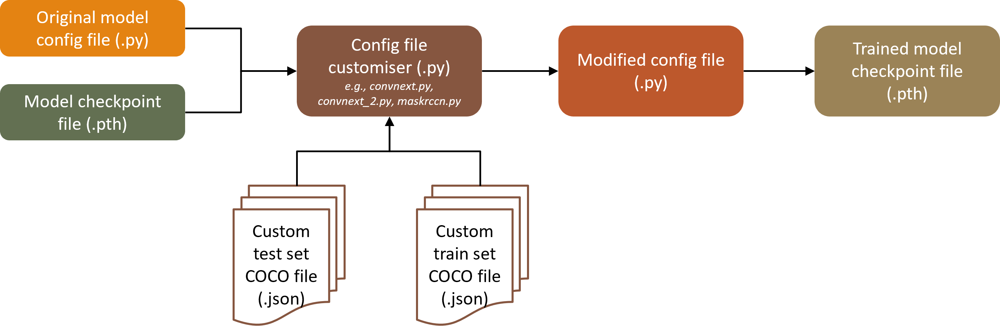

# Instance Segmentation for Automated Defect Detection in Electroluminescence (EL) Images of Photovoltaic (PV) Cells
## 1. Environment Set-up

### Install MMDetection
Follow the installation instructions [here](https://mmdetection.readthedocs.io/en/latest/get_started.html).
GitHub repository: [MMDetection](https://github.com/open-mmlab/mmdetection?tab=readme-ov-file).

### Install MMPreTrain
Follow the installation instructions [here](https://mmpretrain.readthedocs.io/en/stable/get_started.html).

## 2. Dataset Download
### Download the UCF-EL-Defect dataset
Download the dataset to the `data` folder from [here](https://github.com/ucf-photovoltaics/UCF-EL-Defect/tree/main/training/data).
The COCO annotation files (.json) for the training and testing datasets are provided in `data/training` and `data/test`.

## 3. Custom Model Configuration
The workflow for using a custom training dataset with MMDetection is illustrated below:

### Select the model network
Select the model network (.pth) from [MMDetection](https://github.com/open-mmlab/mmdetection?tab=readme-ov-file). For example, the model `.pth` for ConvNeXt-V2 can be downloaded from [here](https://github.com/open-mmlab/mmdetection/tree/main/projects/ConvNeXt-V2). Set this model to `CHECKPOINT_FILE` in the config file customiser (e.g., `convnext.py`, `convnext_2.py`, `maskrccn.py`).
### Select the original model config file
Select the original model config file (.py) from [MMDetection](https://github.com/open-mmlab/mmdetection?tab=readme-ov-file). For example, the config file for ConvNeXt-V2 can be downloaded from [here](https://github.com/open-mmlab/mmdetection/tree/main/projects/ConvNeXt-V2/configs). Set this filename to `MODEL_CONFIG` in the config file customiser (e.g., `convnext.py`, `convnext_2.py`, `maskrccn.py`).

## 4. Training
### Set training mode
In the config file customiser (e.g., `convnext.py`, `convnext_2.py`, `maskrccn.py`), set `TRAIN_MODE = True` for training. Adjust the hyperparameters as required. 
### Run the config file customiser
Run the config file customiser.
### Run the training command
Run the resulted command in the terminal. For example, the resulted command for training is similar to:
`{PYTHON_PATH} tools/train.py {modified_config_path} --work-dir {cfg.work_dir} {amp}` 
The trained model will be saved in `runs`.

## 5. Inference:
### Set inference mode
In the config file customiser (e.g., `convnext.py`, `convnext_2.py`, `maskrccn.py`), set `INFERENCE_MODEL_PATH` to the path of the trained model (.pth) saved in `runs`. Set `TRAIN_MODE` = False for inference.

### Run the config file customiser
Run the config file customiser.

### Run the inference command
Run the resulted command in the terminal. For example, the resulted command for inference is similar to:
`{PYTHON_PATH} tools/test.py {modified_config_path} {checkpoint_file} --show-dir {(OUTPUT_PATH/'test').as_posix()}`

@article{
  hijjawi2023review,
  title   = {A review of automated solar photovoltaic defect detection systems: approaches, challenges, and future orientations},
  author  = {Hijjawi, Ula and Lakshminarayana, Subhash and Xu, Tianhua and Fierro, Gian Piero Malfense and Rahman, Mostafizur},
  journal = {Solar Energy},
  volume  = {266},
  pages   = {112186},
  year    = {2023},
  doi     = {10.1016/j.solener.2023.112186},
  issn    = {0038-092X},
  url     = {https://www.sciencedirect.com/science/article/pii/S0038092X23008204}
}
